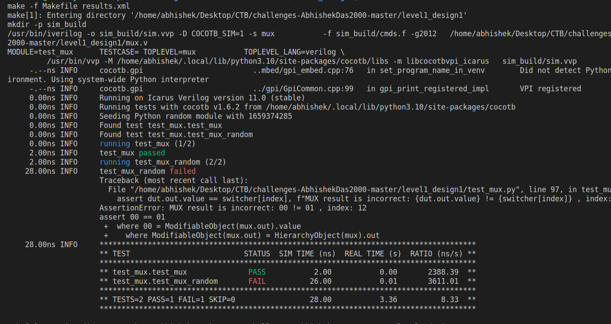
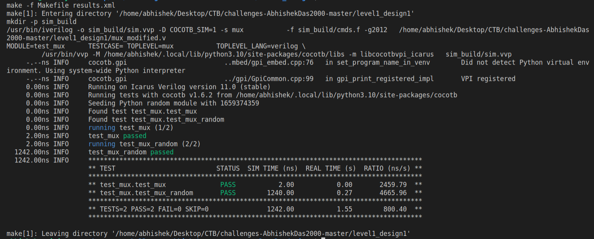

# Welcome to Level 1 Design 1!
This is a simple 32:1 mux with a 5-bit select line implemented in **Verilog**

# File Structure

|Filename           				|Description                         |
|-------------------------------|-----------------------------|
|`'Makefile'`            		|`Contains the Makefile Definations for building the Project`       
|`"mux.v`            |`contains the original buggy mux design`           |
|`mux_modified.v`|`contains the bug free design`|
|`test_mux.py`|`contains the cocotb test bench`

## Verification Strategy

The cocotb test bench has 2 tests
1. test_mux()
2. test_mux_random()
### test_mux()
This tests a simple case to determine that the mux is working as intended. It inputs `2 ` in `inp0` line and inputs `0` in `sel` line. Then the test bench asserts whether the output obtained in `out` line matches with that of the input.
#### Pros
1. Simple to Code
#### Cons
1. Does not take into account all permutations of inputs and outputs

### test_mux_random()

This test inputs a `3-bit` random number in every `inp` lines and then uses a `for - loop` to select all possible combination of `sel` input. The `test-bench` then asserts that all the outputs obtained are in line with the inputs. If there is any discrepency then the `testbench` logs both the `inp` and `out` and the `sel` to make it easy for debugging.

## Bugs Found

On running the `test_mux_random()` test, it was found that there was an assertion error on selecting the `inp12` pin.  After initial rounds of debugging, it was found that the line 40 in the muv.v file i.e `5'b01101: out = inp12;`  had a bug. It should be `5'b01100: out = inp12;`
and the modified design is stored in `mux_modified.v`

## Screenshot
### Failing Test

### Passing Test

