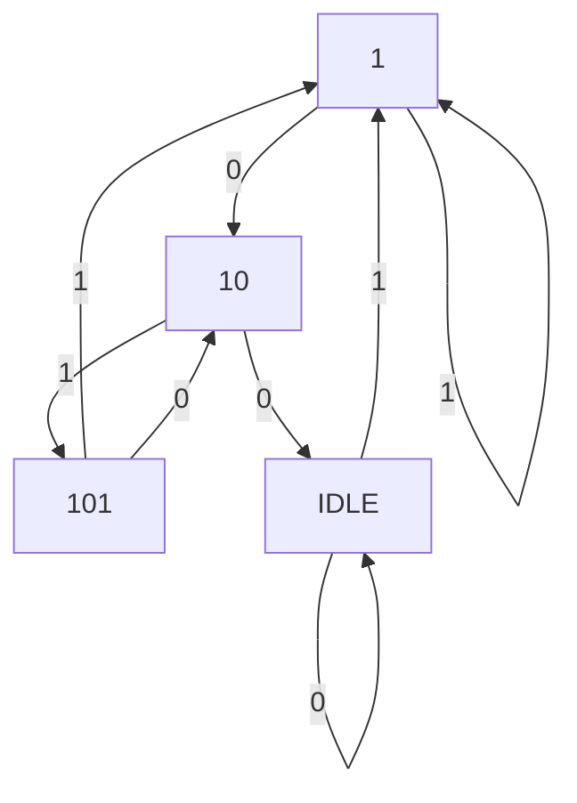

# Welcome to Level 1 Design 2!
This is a simple 1011 sequence detector implemented in **Verilog**


# File Structure

|Filename           				|Description                         |
|-------------------------------|-----------------------------|
|`'Makefile'`            		|`Contains the Makefile Definations for building the Project`       
|`seq_detect_1011.v`            |`contains the original buggy sequence detector design`           |
|`seq_detect_1011_modified.v`	|`contains the bug free design`|
|`seq_model.py`					|`contains the bug free model of the sequence detector to verify the output of the verilog file`
|`test_seq_detect_1011.py`		|`contains the cocotb test bench`

## Verification Strategy

The cocotb test bench has 1 test
1. test_seq_bug()
### test_seq_bug()
This tests a simple case to determine that the sequence detector is working as intended. It inputs `000111011011011011 ` in `inp_bit` line bit-by-bit in each clock cycle. Then the test bench then stores the output from `seq_seen` in a list `positions_circuit`. The expected output is obtained from the model file and stored in `positions_model` list. After all the outputs are obtained from the circuit the testbench asserts whether the outpit obtained from the circuit matches with that of the model
#### Cons
1. Does not take into account the reset switch configuration

## Bugs Found

1. The design specifies that the sequence detector should be able to detect overlapping sequences, i.e the second sequence can begin before the first sequence ends. However lines 
```verilog 
SEQ_101:
      begin
        if(inp_bit == 1)
          next_state = SEQ_1011;
        else
          next_state = IDLE;
      end
```
from state `101` if the next bit is `1` then it moves to state `1011` however if the next bit is `0` , the state machine moves to reset state. This design does not take into account overlapping sequences. To account for overlapping sequences, the code should be modified as 
```verilog 
SEQ_101:
      begin
        if(inp_bit == 1)
          next_state = SEQ_1011;
        else
          next_state = SEQ_10;
      end
```
2. The design requires that the `seq_seen` output should be high one clock cycle after the detection of the sequence. So the state `1011` is redundant. It can be better optimised by using 4 states

If the statemachine is in state `101` and the input is `1` then the state machine moves to `IDLE` state and makes the `seq_seen` output high

