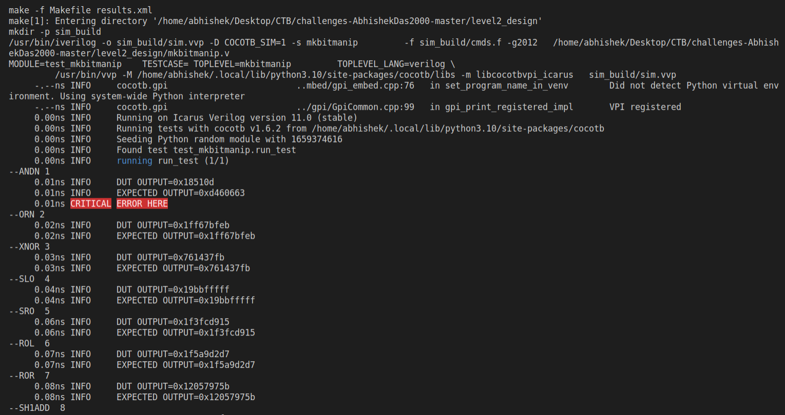
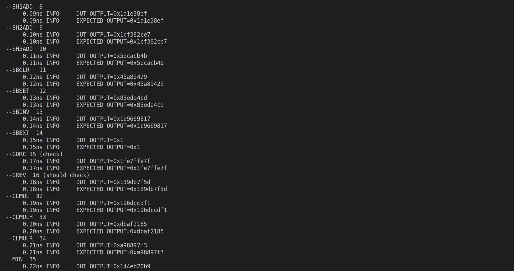
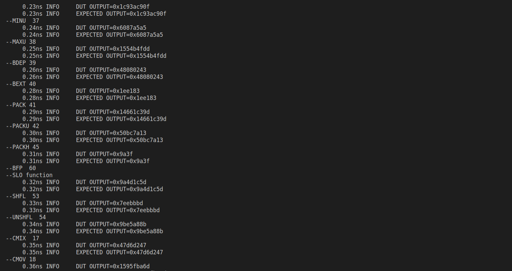
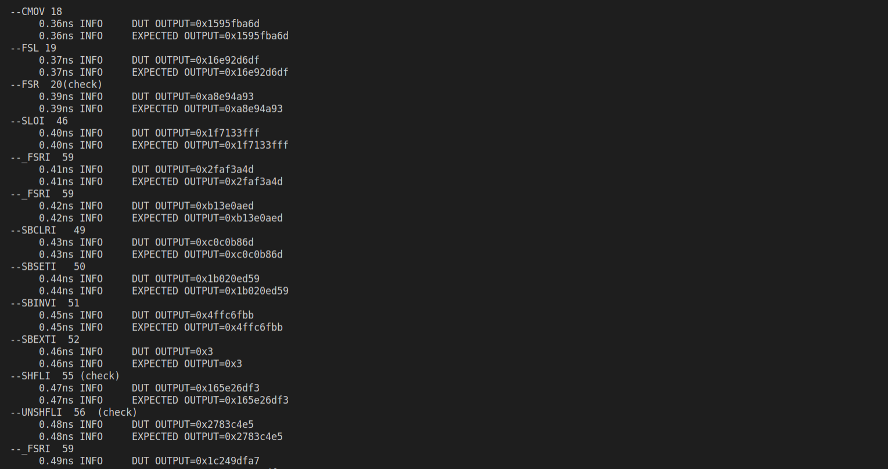
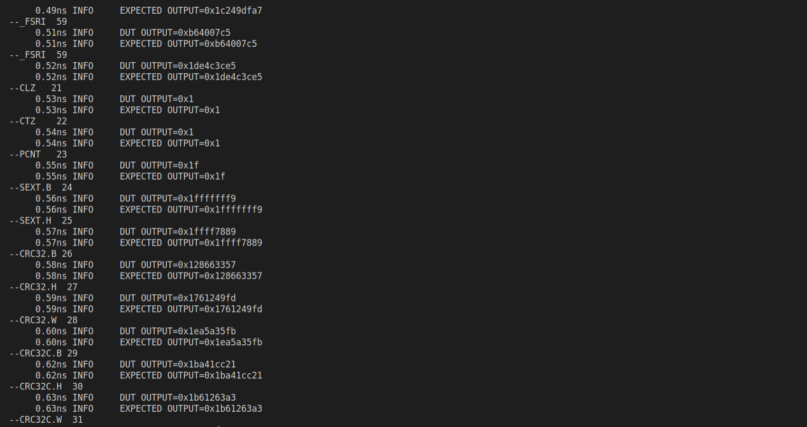
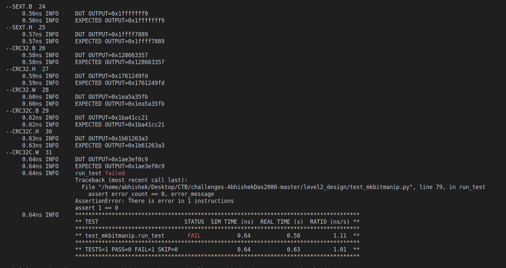

# Welcome to Level 2 Design !
This is a bitmanipulation coprocessor design implemented in **Verilog**

# File Structure

|Filename           				|Description                         |
|-------------------------------|-----------------------------|
|`Makefile`            		|`Contains the Makefile Definations for building the Project`       
|`mkbitmanip.v`            |`contains the original buggy bitmanipulation co-processor design`           |
|`model_mkbitmanip.py`	|`contains the bug free model of the various opcodes supported by the co-processor to verify the output of the verilog file for a given input`
|`random_op_code_generator.py`|`contains a script to generate random configurations of opcodes`
|`test_mkbitmanip.py`		|`contains the cocotb test bench`

## Verification Strategy

The cocotb test bench has 2 tests
1. run_test()
2. debug_ANDN()
### run_test()
This tests runs all the operations supported by the processor with random `32-bit` inputs. It then checks whether the output obtained matches with that of the output obtained from the model. If both the output does not match then the test bench logs it as a Critical error.
### debug_ANDN()
This test tries to debug the ANDN supported by the coprocessor. This function is implmented incorrectly in the verilog design however I couldn't pinpoint the source of the bug 😔

## Bugs Found

1. The ANDN operation does not function properly

## Screenshot
### Failing Test

